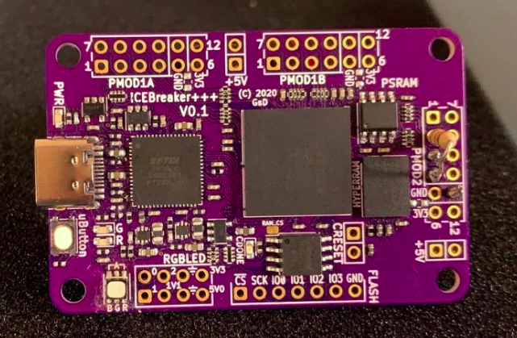

# ICEBreaker++:

<p align="center">
    
</p>

## Examples:

1. Blink: [verilog](https://github.com/ombhilare999/icebreaker-ecp5-examples/tree/main/verilog/blink)

## Steps to program:

```
cd /icebreaker-ecp5-examples/verilog/<example-name>
    
# Directly programs the FPGA (Program is not retain after power cycle)
make prog

# Programs the SPI flash on the board (Program is retained after power cycle)
make flash
# If you have any IP which is booting from qspi flash, 
# then you might want to run make flash twice.
```


## Acknowledgements

- ICEBreaker ++ board designed by greg (can be found [here](https://github.com/gregdavill/advent-calendar-of-circuits-2020/tree/main/icebreaker%2B%2B-ram))
- [orangecrab-examples](https://github.com/orangecrab-fpga/orangecrab-examples)
- [pyfive-test-soc](https://github.com/PyFive-RISC-V/pyfive-test-soc/tree/master/data)

## [LICENSE](https://github.com/ombhilare999/icebreaker-ecp5-examples/blob/main/LICENSE)
