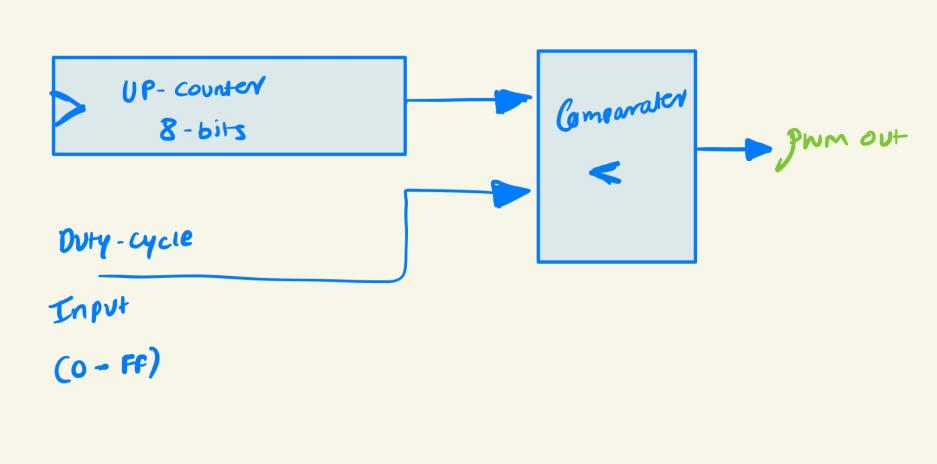

# PWM

- The RGB Pins of `icebreaker++` board are connected in sink mode, so we need to send negated signal to the Pins.

<p align="center">
    
</p>

- This is very simple PWM generator. A up counter produces counts from `0x00 - 0xFF` and comparator compares the Input duty cycle with count. Accordingly sets the output pwm.

## Steps to program

```
make prog   # If you need to program the FPGA directly
or 
make flash  # If you need to program the SRAM first
```